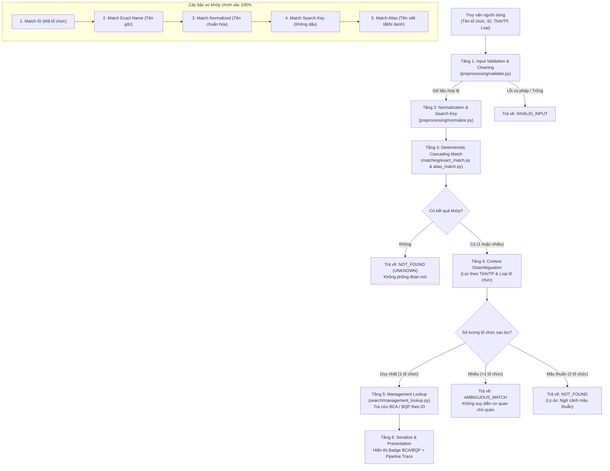

# 🏛️ Hệ Thống Tra Cứu & Định Danh Tổ Chức — BCA / BQP

Hệ thống tra cứu và định danh thực thể tổ chức thuộc **Bộ Công an (BCA)** và **Bộ Quốc phòng (BQP)** dựa trên kiến trúc **Strict Deterministic Entity Resolution**. 

Mục tiêu cốt lõi của hệ thống: **Định danh chính xác thực thể tổ chức trước (100% Match hoặc UNKNOWN), sau đó thực hiện tra cứu cơ quan chủ quản (BCA / BQP) từ Master Registry**. Hệ thống hoàn toàn không sử dụng thuật toán xấp xỉ/phỏng đoán mờ, đảm bảo tính toàn vẹn và độ tin cậy tuyệt đối của dữ liệu.

---

## 📌 Mục lục

1. [Triết lý Thiết kế Cốt lõi](#-triết-lý-thiết-kế-cốt-lõi)
2. [Sơ đồ Pipeline & Luồng Hoạt Động](#-sơ-đồ-pipeline--luồng-hoạt-động)
3. [Chi Tiết Các Tầng Xử Lý Trong Pipeline](#-chi-tiết-các-tầng-xử-lý-trong-pipeline)
4. [Cấu Trúc Thư Mục Dự Án](#-cấu-trúc-thư-mục-dự-án)
5. [Hướng Dẫn Cài Đặt & Chạy Hệ Thống (Step-by-Step)](#-hướng-dẫn-cài-đặt--chạy-hệ-thống-step-by-step)
6. [Hướng Dẫn Sử Dụng Chi Tiết](#-hướng-dẫn-sử-dụng-chi-tiết)
7. [Sử Dụng Qua Python API](#-sử-dụng-qua-python-api)
8. [Bảng Mã Phân Loại Tổ Chức](#-bảng-mã-phân-loại-tổ-chức)

---

## 💡 Triết lý Thiết kế Cốt lõi

1. **Strict Deterministic Search (Chính xác 100% hoặc Unknown)**:
   - Hệ thống chỉ kết luận cơ quan chủ quản khi đã định danh đúng 100% tổ chức trong cơ sở dữ liệu đã kiểm định.
   - Nếu dữ liệu đầu vào không đủ căn cứ để xác định chính xác, hệ thống trả về `UNKNOWN` thay vì đoán mò.
2. **Phân tách Độc lập giữa Định danh Thực thể và Cơ quan Quản lý**:
   - `Entity Resolution`: Xác định ID tổ chức dựa trên Tên, Tên chuẩn hóa, Tên không dấu, Tên viết tắt/bí danh.
   - `Management Lookup`: Sau khi đã có ID tổ chức duy nhất, thực hiện đọc trường `management` (`BCA` hoặc `BQP`) trực tiếp từ Master Registry.
3. **Bất biến Dữ liệu & An toàn Tuyệt đối**:
   - Tầng so khớp (Matching Layer) hoạt động trên đối tượng `OrganizationRecord` hoàn toàn không chứa trường `management`. Tránh việc cơ quan chủ quản bị can thiệp trong quá trình định danh.

---

## 🔄 Sơ đồ Pipeline & Luồng Hoạt Động



---

## 🔬 Chi Tiết Các Tầng Xử Lý Trong Pipeline

### Tầng 1: Kiểm tra & Làm sạch Dữ liệu Đầu vào (`preprocessing/validate.py`)
- Kiểm tra giới hạn độ dài chuỗi (`MAX_ORGANIZATION_ID_LENGTH = 128`, `MAX_ORGANIZATION_NAME_LENGTH = 512`, `MAX_CONTEXT_LENGTH = 128`).
- Loại bỏ ký tự độc hại (ví dụ: NUL byte `\x00`), cắt tỉa khoảng trắng thừa hai đầu.
- Bắt buộc phải cung cấp ít nhất `organization_id` hoặc `organization_name`.

### Tầng 2: Chuẩn hóa & Sinh Khóa Tra cứu (`preprocessing/normalize.py`)
- **`normalize_name(value)`**:
  1. Chuẩn hóa Unicode theo chuẩn **NFKC**.
  2. Chuyển toàn bộ về chữ thường (`casefold()`).
  3. Chuyển toàn bộ dấu câu và ký tự đặc biệt thành khoảng trắng.
  4. Thu gọn khoảng trắng liên tiếp về một dấu cách duy nhất.
- **`to_search_key(value)`**:
  1. Thay thế chữ cái `đ`/`Đ` tiếng Việt thành `d`/`D`.
  2. Phân rã ký tự có dấu thành mã tổ hợp Unicode (**NFD**).
  3. Lọc bỏ toàn bộ dấu thanh/dấu phụ (Unicode category `Mn`).
  4. Trả về chuỗi không dấu hoàn toàn theo chuẩn **NFC** (Ví dụ: `Công an tỉnh Thái Bình` $\rightarrow$ `cong an tinh thai binh`).

### Tầng 3: Bậc Thang So Khớp Chính Xác 100% (Deterministic Match Cascade)
Hệ thống duyệt tuần tự qua 5 bậc ưu tiên:
1. **`EXACT_ID_MATCH`**: Tìm kiếm trực tiếp theo Mã định danh duy nhất (`organization_id`).
2. **`EXACT_NAME_MATCH`**: So khớp chính xác 100% với tên đăng ký gốc trong cơ sở dữ liệu.
3. **`NORMALIZED_MATCH`**: So khớp qua tên đã chuẩn hóa (bỏ dấu câu, viết thường, chuẩn hóa khoảng trắng).
4. **`SEARCH_KEY_MATCH`**: So khớp qua khóa không dấu (cho phép người dùng gõ không dấu tiếng Việt).
5. **`ALIAS_MATCH`**: So khớp với từ điển tên viết tắt / tên gọi tắt chính thức (`data/aliases.csv`).

### Tầng 4: Lọc Ngữ Cảnh & Xử Lý Xung Đột (Context Disambiguation)
Nếu có nhiều tổ chức trùng tên, hệ thống dùng ngữ cảnh bổ sung để phân định:
- **Ưu tiên 1**: Lọc theo Tỉnh / Thành phố (`province_name`).
- **Ưu tiên 2**: Lọc theo Loại tổ chức (`organization_type_code`).
- **Xử lý kết quả**:
  - Nếu còn lại **đúng 1 tổ chức**: Phân giải thành công (`RESOLVED`).
  - Nếu vẫn còn **nhiều hơn 1 tổ chức**: Đánh dấu `AMBIGUOUS_MATCH` (trả về danh sách để người dùng chọn, không kết luận BCA/BQP).
  - Nếu ngữ cảnh mâu thuẫn với thực thể: Đánh dấu `NOT_FOUND` với lý do `DETERMINISTIC_MATCH_CONTEXT_MISMATCH`.

### Tầng 5: Tra Cứu Cơ Quan Quản Lý (`search/management_lookup.py`)
- Chỉ chạy khi tổ chức đã được định danh chính xác 100%.
- Đọc trường `management` từ Master Registry theo `organization_id`.
- Kiểm tra tính hợp lệ: Chỉ chấp nhận giá trị thuộc `{"BCA", "BQP"}`. Nếu thiếu hoặc sai khác sẽ kích hoạt ngoại lệ `RegistryDataError`.

### Tầng 6: Kết Xuất & Trực Quan Hóa (Serialization & Pipeline Trace)
- Trả về payload có cấu trúc (`match_status`, `organization_id`, `organization_name`, `province_name`, `organization_type_code`, `management`).
- Trực quan hóa từng bước trong chuỗi xử lý (Pipeline Trace) trên giao diện Web UI.

---

## 📁 Cấu Trúc Thư Mục Dự Án

```text
manage_bca_bqp/
├── app.py                      # Ứng dụng Web Gradio (Dark theme, Pipeline Trace, Strict Mode)
├── pyproject.toml              # Cấu hình gói và dependencies của dự án
├── requirements.txt            # Danh sách thư viện Python (pandas, gradio)
├── data/
│   ├── dataset.csv             # Cơ sở dữ liệu Master Registry (~3.9 MB, hàng nghìn tổ chức BCA & BQP)
│   └── aliases.csv             # Danh mục tên viết tắt / biệt danh ánh xạ về mã tổ chức
├── preprocessing/              # Module tiền xử lý dữ liệu
│   ├── normalize.py            # Hàm chuẩn hóa Unicode, loại bỏ dấu tiếng Việt, sinh search key
│   └── validate.py             # Kiểm tra tính hợp lệ của tham số đầu vào
├── matching/                   # Tầng thuật toán định danh thực thể (Strict Deterministic)
│   ├── models.py               # Định nghĩa Data models (OrganizationRecord, MatchResolution, MatchStatus)
│   ├── exact_match.py          # So khớp chính xác: ID, Tên gốc, Tên chuẩn hóa, Khóa không dấu
│   ├── alias_match.py          # So khớp theo từ điển tên viết tắt (Alias)
│   ├── repository.py           # Kho lưu trữ dữ liệu (In-Memory & SQLAlchemy)
│   └── resolver.py             # Bộ điều phối trung tâm (Resolver Orchestrator)
└── search/                     # Tầng dịch vụ tra cứu cơ quan chủ quản
    ├── management_lookup.py    # Tra cứu cơ quan quản lý BCA / BQP sau khi đã xác định ID
    └── organization_search.py  # Service Facade kết nối Resolver và Management Lookup
```

---

## 🚀 Hướng Dẫn Cài Đặt & Chạy Hệ Thống (Step-by-Step)

### Bước 1: Chuẩn bị môi trường Python
Yêu cầu: **Python 3.11** trở lên.

Mở terminal và điều hướng đến thư mục dự án:
```bash
cd d:\manage_bca_bqp
```

Tạo môi trường ảo (virtual environment):
```bash
python -m venv .venv
```

Kích hoạt môi trường ảo:
- **Trên Windows (PowerShell)**:
  ```powershell
  .venv\Scripts\Activate.ps1
  ```
- **Trên Windows (Command Prompt)**:
  ```cmd
  .venv\Scripts\activate.bat
  ```
- **Trên Linux / macOS**:
  ```bash
  source .venv/bin/activate
  ```

---

### Bước 2: Cài đặt các thư viện phụ thuộc
- **Nếu sử dụng `uv` (Môi trường hiện tại của dự án)**:
  ```bash
  uv pip install -r requirements.txt
  ```
- **Nếu sử dụng `pip` thông thường**:
  ```bash
  python -m pip install -r requirements.txt
  ```

---

### Bước 3: Khởi chạy Giao diện Web (Gradio Web UI)
Khởi chạy file `app.py`:

```bash
python app.py
```

Khi chạy thành công, màn hình terminal sẽ hiển thị thông báo:
```text
[INFO] Loading dataset into memory...
[INFO] Registry loaded: 4,000+ organizations (... BCA, ... BQP)
* Running on local URL:  http://127.0.0.1:7860
```

Mở trình duyệt web và truy cập vào địa chỉ:
👉 **`http://127.0.0.1:7860`**

---

## 🖥️ Hướng Dẫn Sử Dụng Chi Tiết

### 1. Tra cứu Cơ bản bằng Tên tổ chức
1. Nhập tên đơn vị cần tra cứu vào ô **"🔍 Tên tổ chức cần tra cứu"**.
2. Nhấn phím **Enter** hoặc bấm nút **"🔍 Tra cứu ngay"**.
3. **Các định dạng đầu vào được hỗ trợ:**
   - **Tên đầy đủ có dấu**: `Công an tỉnh Thái Bình`, `Bộ Chỉ huy Quân sự tỉnh Quảng Ninh`.
   - **Tên không dấu**: `cong an tinh thai binh`, `bo chi huy quan su tinh quang ninh`.
   - **Tên viết tắt / Ký hiệu**: `BCHQS huyện Sóc Sơn`, `Học viện CSND`.
   - **Chữ hoa / chữ thường**: Hệ thống tự động chuẩn hóa mà không phân biệt hoa thường.

### 2. Tra cứu Nâng cao (Lọc theo Mã ID, Tỉnh/TP, Loại tổ chức)
1. Bấm mở rộng mục **"🔧 Tra cứu nâng cao (Lọc theo ID, Tỉnh/TP, Loại)"**.
2. Có thể kết hợp một hoặc nhiều tiêu chí:
   - **Mã tổ chức (ID)**: Ví dụ `BCA-PROVINCE-002153` (cho kết quả tức thì).
   - **Tỉnh / Thành phố**: Chọn từ danh sách dropdown để định vị chính xác địa phương.
   - **Loại tổ chức**: Chọn loại hình cụ thể (Công an tỉnh, Ban CHQS huyện, Trại giam, Bệnh viện QY...).

### 3. Thử Nhanh Các Ví Dụ Mẫu (Examples)
Bấm vào các ví dụ mẫu có sẵn bên dưới thanh tìm kiếm để kích hoạt tra cứu nhanh.

---

### 4. Đọc & Hiểu Kết Quả Trả Về

#### Trường hợp 1: Khớp chính xác 100% (`MATCH_100`)
Giao diện sẽ hiển thị:
- **Badge Cơ quan Quản lý**:
  - 🔵 **BCA** (Xanh dương) — **Bộ Công an**
  - 🟢 **BQP** (Xanh lá cây) — **Bộ Quốc phòng**
- **Thẻ trạng thái**: `✅ ĐÚNG 100% — Khớp tên sau chuẩn hóa` (hoặc Khớp chính xác mã ID, Khớp không dấu, Khớp tên viết tắt).
- **Bảng chi tiết tổ chức**:
  - Mã tổ chức (ID)
  - Tên chính thức
  - Tỉnh / Thành phố
  - Loại tổ chức
  - Cơ quan chủ quản xác thực

#### Trường hợp 2: Không tìm thấy dữ liệu (`UNKNOWN`)
Nếu tên tổ chức không có trong dữ liệu hoặc nhập sai lệch:
- Hệ thống hiển thị thông báo: `❌ UNKNOWN (Không có dữ liệu)`.
- **Nguyên tắc Strict Deterministic**: Hệ thống từ chối đoán mò, bảo đảm an toàn dữ liệu.

#### Khu vực `Pipeline Trace` (Luồng xử lý chi tiết)
Ở cuối mỗi kết quả, hệ thống cung cấp bảng trace minh bạch từng bước:
1. **Query đầu vào**: Chuỗi người dùng nhập.
2. **Normalization**: Chuỗi sau khi hạ chữ thường, bỏ ký tự đặc biệt, chuẩn hóa khoảng trắng.
3. **Search Key**: Chuỗi sau khi bóc tách toàn bộ dấu thanh tiếng Việt.
4. **Strict Match**: Trạng thái trúng (`HIT`) hoặc trượt (`MISS`) ở tầng deterministic.
5. **Fuzzy Match**: `DISABLED` ở Strict Mode.
6. **Kết luận**: Kết quả phân giải cuối cùng.

---

## 💻 Sử Dụng Qua Python API

Bạn có thể nhúng module tra cứu vào các ứng dụng hoặc script Python:

```python
from pathlib import Path
import pandas as pd

from matching.repository import InMemoryOrganizationRepository
from matching.resolver import MatchingConfig
from search.organization_search import OrganizationSearchService

# 1. Khởi tạo repository từ file CSV
dataset_path = Path("data/dataset.csv")
aliases_path = Path("data/aliases.csv")

df_orgs = pd.read_csv(dataset_path, dtype=str, keep_default_na=False).to_dict("records")
df_aliases = pd.read_csv(aliases_path, dtype=str, keep_default_na=False).to_dict("records")
repository = InMemoryOrganizationRepository(df_orgs, df_aliases)

# 2. Khởi tạo Search Service ở chế độ Strict Mode
config = MatchingConfig(strict_mode=True)
service = OrganizationSearchService(repository, config)

# 3. Thực hiện tra cứu
result = service.search_organization(
    organization_name="Công an tỉnh Thái Bình",
    province_name="Thái Bình",
)

# 4. Xử lý kết quả trả về
if result.get("management"):
    print(f"✅ Đã tìm thấy: {result['organization_name']}")
    print(f"🏛️ Cơ quan chủ quản: {result['management']}")  # 'BCA' hoặc 'BQP'
    print(f"🆔 Mã tổ chức: {result['organization_id']}")
    print(f"📌 Trạng thái khớp: {result['match_status']}")
else:
    print(f"❌ Không tìm thấy dữ liệu hoặc không khớp chính xác ({result['match_status']})")
```

---

## 🏷️ Bảng Mã Phân Loại Tổ Chức

Hệ thống hỗ trợ chuẩn hóa và phân loại các đơn vị theo bảng mã chuẩn:

| Mã Loại (`organization_type_code`) | Tên Loại Đơn Vị | Thuộc Khối |
| :--- | :--- | :---: |
| `POLICE_PROVINCE` | Công an tỉnh / Thành phố trực thuộc Trung ương | BCA |
| `POLICE_DEPARTMENT` | Phòng ban nghiệp vụ Công an tỉnh | BCA |
| `POLICE_DISTRICT` | Công an huyện / quận / thị xã | BCA |
| `POLICE_DISTRICT_DEPT` | Đội nghiệp vụ Công an huyện / quận | BCA |
| `POLICE_PRISON` | Trại giam | BCA |
| `POLICE_HOSPITAL` | Bệnh viện Công an | BCA |
| `MILITARY_PROVINCE` | Bộ Chỉ huy Quân sự tỉnh / Thành phố | BQP |
| `MILITARY_DEPARTMENT` | Phòng ban trực thuộc Bộ CHQS tỉnh | BQP |
| `MILITARY_DISTRICT` | Ban Chỉ huy Quân sự huyện / quận | BQP |
| `MILITARY_DISTRICT_DEPT`| Ban / Đội nghiệp vụ Ban CHQS huyện | BQP |
| `MILITARY_BORDER_CMD` | Bộ Chỉ huy Bộ đội Biên phòng tỉnh | BQP |
| `MILITARY_BORDER_POST` | Đồn Biên phòng / Trạm Biên phòng | BQP |
| `MILITARY_BORDER_SQUADRON`| Hải đội Biên phòng | BQP |
| `MILITARY_HOSPITAL` | Bệnh viện Quân y | BQP |
| `MILITARY_REGION` | Quân khu | BQP |
| `MILITARY_SERVICE` | Quân chủng / Binh chủng | BQP |
| `ACADEMY` | Học viện | BCA / BQP |
| `UNIVERSITY` | Trường Đại học / Cao đẳng / Trung cấp | BCA / BQP |
| `GENERAL_DEPARTMENT` | Cục / Vụ trực thuộc Bộ | BCA / BQP |
