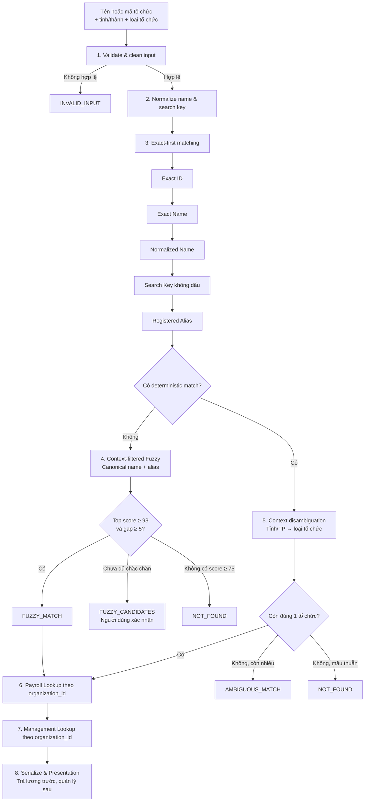

# Tra cứu tổ chức, nguồn trả lương và phạm vi quản lý BCA/BQP

Hệ thống định danh tổ chức từ tên hoặc mã, đối chiếu với Organization Registry, sau đó trả hai kết luận độc lập:

1. **Kết luận ưu tiên:** tổ chức/đơn vị nào trả lương.
2. **Kết luận bổ sung:** tổ chức thuộc phạm vi quản lý của BCA hay BQP.

Matching được thiết kế theo nguyên tắc **Exact-first, Fuzzy-safe**: các phép so khớp xác định luôn chạy trước; fuzzy chỉ là fallback có ngưỡng an toàn. Dữ liệu trả lương và quản lý không tham gia vào quá trình matching.

## Kết quả trả về

Một kết quả đã phân giải có dạng:

```json
{
  "match_status": "EXACT_ID_MATCH",
  "match_score": 100,
  "organization_id": "BCA-CENTRAL-000003",
  "organization_name": "Cục Đào tạo",
  "province_name": "Hà Nội",
  "organization_type_code": "MINISTRY_DEPARTMENT",
  "paying_organization": "BQP",
  "payroll_status": "Do BQP trả lương",
  "management": "BCA"
}
```

`paying_organization` và `management` là hai dữ kiện độc lập. Hệ thống không suy ra bên trả lương từ cơ quan quản lý hoặc ngược lại.

## Pipeline xử lý



### Thứ tự matching

| Ưu tiên | Phương thức | Trạng thái | Điểm |
| ---: | --- | --- | ---: |
| 1 | Mã tổ chức chính xác | `EXACT_ID_MATCH` | 100 |
| 2 | Tên gốc chính xác | `EXACT_NAME_MATCH` | 100 |
| 3 | Tên sau chuẩn hóa Unicode/khoảng trắng | `NORMALIZED_MATCH` | 100 |
| 4 | Search key không dấu | `SEARCH_KEY_MATCH` | 100 |
| 5 | Tên viết tắt hoặc bí danh đã đăng ký | `ALIAS_MATCH` | 100 |
| 6 | Fuzzy canonical name/alias | `FUZZY_MATCH` | 93–99.99 |

Mã tổ chức chỉ dùng exact match. Hệ thống không fuzzy ID vì một ký tự sai có thể trỏ sang thực thể khác.

### Chính sách fuzzy an toàn

Cấu hình mặc định nằm trong `matching/resolver.py`:

- Điểm tự động phân giải tối thiểu: `93`.
- Điểm tối thiểu để xuất hiện trong danh sách ứng viên: `75`.
- Khoảng cách tối thiểu với ứng viên thứ hai: `5` điểm.
- Số ứng viên tối đa trả về: `5`.
- Chuỗi dưới 5 ký tự không được fuzzy match.

Nếu không đủ điều kiện tự động phân giải, API trả `FUZZY_CANDIDATES` và không trả dữ liệu lương/quản lý cho đến khi người dùng chọn đúng tổ chức.

## Dữ liệu Registry

File chính: `data/dataset.csv`.

| Cột | Vai trò |
| --- | --- |
| `organization_id` | Mã duy nhất của tổ chức |
| `organization_name` | Tên chính thức |
| `organization_name_normalized` | Tên đã chuẩn hóa |
| `organization_name_search_key` | Khóa tìm kiếm không dấu |
| `organization_type_code` | Mã loại tổ chức |
| `organization_level` | Cấp tổ chức |
| `parent_organization_id` | Mã tổ chức cha |
| `province_name` | Tỉnh/thành phố |
| `co_quan_tra_luong` | Tổ chức/khối trả lương được ghi nhận |
| `trang_thai_tra_luong` | Kết luận trạng thái trả lương |
| `management` | Phạm vi quản lý `BCA` hoặc `BQP` |

Lưu ý: một số dòng chỉ ghi `UBND Địa phương`, `Tranh chấp (Chưa xác định)` hoặc để trống `co_quan_tra_luong`. Hệ thống trả nguyên trạng dữ liệu Registry, không tự tạo tên đơn vị cụ thể.

Alias chính thức được lưu tại `data/aliases.csv`.

## Cấu trúc dự án

```text
manage_bca_bqp/
├── api/
│   └── main.py                  # FastAPI endpoints
├── data/
│   ├── dataset.csv              # Master Organization Registry
│   └── aliases.csv              # Tên viết tắt/bí danh
├── frontend/                    # React + TypeScript + Vite
│   ├── src/
│   │   ├── components/
│   │   ├── services/
│   │   ├── types/
│   │   ├── App.tsx
│   │   └── styles.css
│   ├── Dockerfile
│   ├── nginx.conf
│   └── package.json
├── matching/
│   ├── exact_match.py
│   ├── alias_match.py
│   ├── fuzzy_match.py
│   ├── models.py
│   ├── repository.py
│   └── resolver.py
├── preprocessing/
│   ├── normalize.py
│   └── validate.py
├── search/
│   ├── organization_search.py
│   ├── payroll_lookup.py
│   └── management_lookup.py
├── tests/                       # Unit + integration tests
├── app.py                       # Gradio UI tùy chọn
├── Dockerfile.backend
├── docker-compose.yml
├── requirements-backend.txt
└── requirements.txt
```

## Chạy nhanh bằng Docker

Yêu cầu:

- Docker Desktop đang chạy.
- Cổng `3000` và `7860` chưa bị ứng dụng khác sử dụng.

Tại thư mục gốc dự án:

```powershell
docker compose up -d --build
```

Hoặc trên Windows:

```powershell
.\start.bat
```

Truy cập:

- Giao diện React: http://localhost:3000
- Swagger API: http://localhost:7860/docs
- Healthcheck: http://localhost:7860/health

Kiểm tra container:

```powershell
docker compose ps
```

Xem log:

```powershell
docker compose logs -f
docker compose logs -f backend
docker compose logs -f frontend
```

Dừng hệ thống:

```powershell
docker compose down
```

## Chạy ở chế độ phát triển

### Backend FastAPI

Yêu cầu Python 3.11 trở lên:

```powershell
python -m venv .venv
.\.venv\Scripts\Activate.ps1
python -m pip install -r requirements-backend.txt
python -m uvicorn api.main:app --host 127.0.0.1 --port 7860 --reload
```

### Frontend React

Mở terminal thứ hai:

```powershell
cd frontend
npm ci
npm run dev
```

Truy cập http://localhost:5173. Vite proxy `/api` và `/health` tới backend tại cổng `7860`.

Khi frontend và backend chạy trên hai domain khác nhau, cấu hình domain được phép gọi API bằng biến môi trường backend:

```text
CORS_ORIGINS=https://bca-bqp-frontend.onrender.com
```

Có thể khai báo nhiều domain, phân tách bằng dấu phẩy. Không dùng `*` cho môi trường production.

### Gradio UI tùy chọn

```powershell
python -m pip install -r requirements.txt
python app.py
```

Truy cập http://127.0.0.1:7860. Không chạy Gradio đồng thời với FastAPI trên cùng cổng.

## Sử dụng API

### Tìm theo tên

```powershell
$body = @{
  organization_name = "Cục Đào tạo"
  province_name = "Hà Nội"
} | ConvertTo-Json

Invoke-RestMethod `
  -Method Post `
  -Uri "http://localhost:7860/api/v1/organizations/search" `
  -ContentType "application/json; charset=utf-8" `
  -Body ([Text.Encoding]::UTF8.GetBytes($body))
```

### Tìm theo ID

```text
GET http://localhost:7860/api/v1/organizations/BCA-CENTRAL-000003
```

### Endpoints

| Method | Endpoint | Mục đích |
| --- | --- | --- |
| `GET` | `/health` | Trạng thái và tổng số bản ghi |
| `POST` | `/api/v1/organizations/search` | Tra cứu bằng JSON body |
| `GET` | `/api/v1/organizations/search` | Tra cứu bằng query parameters |
| `GET` | `/api/v1/organizations/{organization_id}` | Lấy bản ghi theo ID |

## Trạng thái kết quả

| Trạng thái | Ý nghĩa |
| --- | --- |
| `EXACT_ID_MATCH` | Khớp ID tuyệt đối |
| `EXACT_NAME_MATCH` | Khớp tên gốc tuyệt đối |
| `NORMALIZED_MATCH` | Khớp sau chuẩn hóa |
| `SEARCH_KEY_MATCH` | Khớp tên không dấu |
| `ALIAS_MATCH` | Khớp alias đã đăng ký |
| `FUZZY_MATCH` | Fuzzy đủ ngưỡng tự động phân giải |
| `FUZZY_CANDIDATES` | Có ứng viên nhưng cần người dùng xác nhận |
| `AMBIGUOUS_MATCH` | Nhiều deterministic match cùng hợp lệ |
| `NOT_FOUND` | Không tìm thấy kết quả đủ an toàn |
| `INVALID_INPUT` | Dữ liệu đầu vào không hợp lệ |

## Kiểm thử và build

Chạy test Python:

```powershell
python -m unittest discover -s tests -v
```

Build frontend:

```powershell
cd frontend
npm ci
npm run build
```

Kiểm thử đầy đủ bằng Docker:

```powershell
docker compose build
docker compose up -d
docker compose ps
```

## Nguyên tắc an toàn dữ liệu

- `OrganizationRecord` dùng cho matching không chứa dữ liệu lương hoặc quản lý.
- Payroll và management chỉ được lookup sau khi có duy nhất một `organization_id`.
- Không trả nhãn lương/quản lý cho kết quả fuzzy chưa được xác nhận.
- Không biến giá trị trống thành BCA, BQP hoặc UBND bằng suy đoán.
- Context mâu thuẫn với deterministic match trả `NOT_FOUND`; hệ thống không bỏ qua context để tìm một tổ chức khác.
